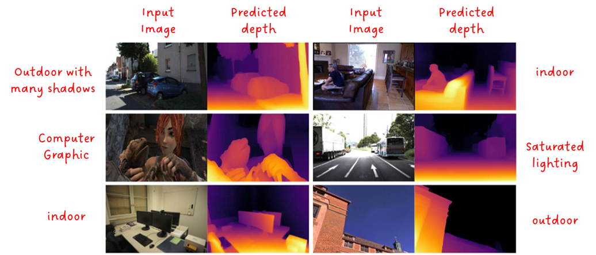

# Real-Time Monocular Depth Estimation Using Laptop Camera 🎥📏

> A Computer Vision project for estimating depth from real-time webcam input using MiDaS models.

 

---

## 🔍 Overview

This project explores **monocular depth estimation** using a standard **laptop webcam**, leveraging state-of-the-art MiDaS models (DPT-based) for real-time prediction.

Instead of expensive stereo setups or depth sensors, we use a single RGB stream and deep learning to infer per-pixel depth maps. The project includes:

- Real-time video processing with OpenCV
- Depth inference using pretrained MiDaS models from PyTorch Hub
- Streamlit-based GUI
- Optional saving of output videos in `output/` folder

---

## 🧠 Motivation

Depth estimation is essential in autonomous driving, AR/VR, and robotics. This project demonstrates the potential of deploying cutting-edge research like MiDaS (Vision Transformers) on resource-constrained devices like laptops.

---

## 🚀 Features

- 🔹 Real-time depth estimation from your webcam
- 🔹 Selectable MiDaS models (`DPT_Large`, `DPT_Small`)
- 🔹 Visualize RGB frame + depth map side-by-side
- 🔹 Save outputs as videos in `output/` folder
- 🔹 Simple UI with Streamlit

 
---

## 🛠️ Installation

### 1. Clone the repository

```bash
git clone https://github.com/your-username/depth-estimation.git
cd depth-estimation
